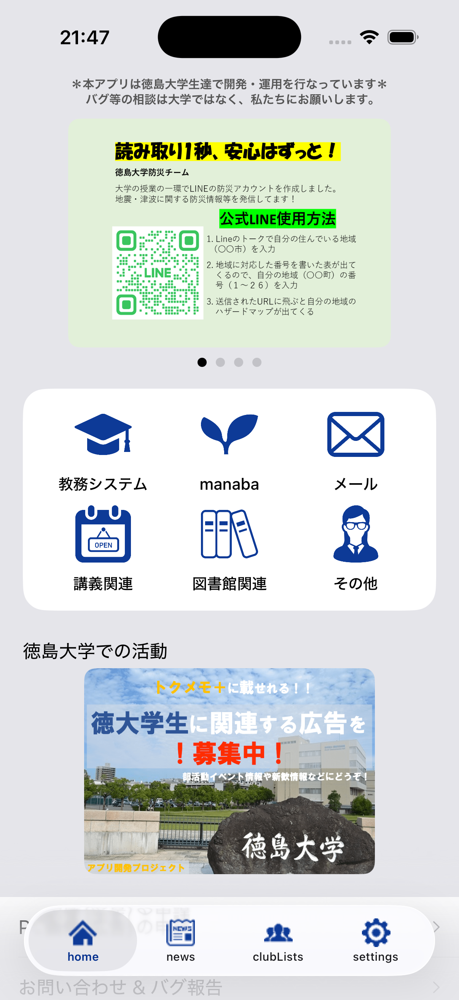
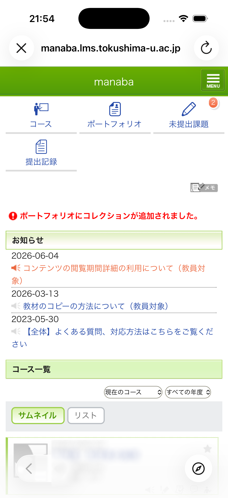
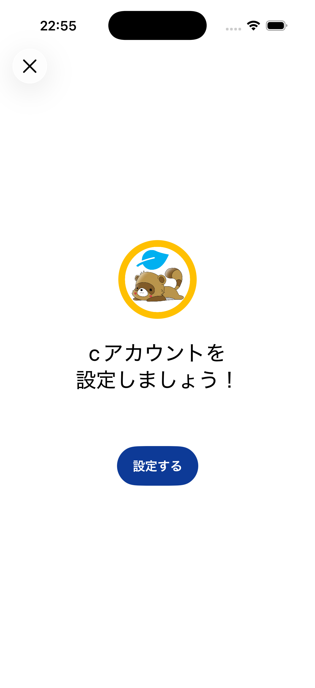
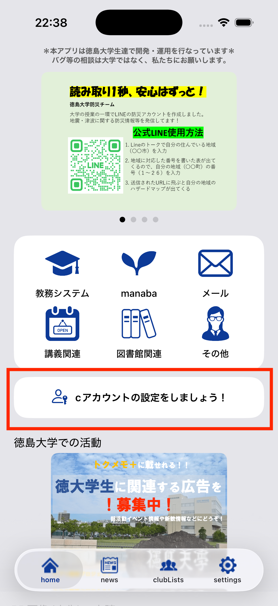
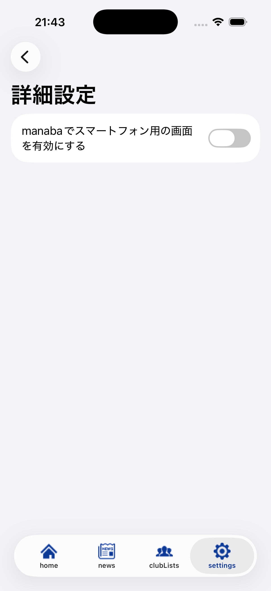

# v6.0.0 — 2026-05-06

## Overview

今回のアップデートでは主に以下のことを行いました！
- UIKit -> SwiftUI へのリアーキテクト
- Liquid Glass の対応

他にも細かな不具合の修正などを行なっています！

## Update highlights

### 1. Liquid Glass化

WWDC 25 で発表された **Liquid Glass** に対応しました！  

|ホーム画面|LMS（manaba）|
|--------|-------|
|||

### 2. SwiftUI へのリアーキテクト

UIKit -> SwiftUI への移行を行いました！

Claude Code を使用してリアーキテクトを行い、細かい仕様の再現や不具合の修正をしました。
仕様を誤って変更しないように Claude Code の設定を行い、旧バージョンから使っている人でも違和感なく使えるように実装しました！
さらに、iPhone/iPadのシミュレーションテスト、実機テストを入念に行い、リアーキテクト対応で発生する不具合を最小に努めることが出来ました。

### 3. 学生アカウントの設定を促す画面

徳島大学生は情報システムにアクセスするためのアカウント(以下、学生アカウント)を持っています。
学生アカウントを設定できることを知らない人や設定のやり方がわからない人がいたため、設定を促すような画面の実装をしました！
- 初回起動時に学生アカウント設定画面を表示
- 学生アカウントを設定していない場合、ホーム画面に、設定を促すボタンを表示

|初回起動時の画面|学生アカウント未設定時のホーム画面|
|--------------|--------------------------|
|||

### 4. 詳細設定画面

LMS（manaba）のスマホ用画面とPC用画面を **詳細設定画面** から切り替えられるようになりました！

|詳細設定画面|
|----------|
||

### 5. その他の細かな変更

- アプリ内リンクを最新のリンクに変更
    - 図書館のリンク
    - 公式サイト
- 画像をフォトに保存できない問題を修正
- クレジットをiPhoneの設定に表示させるように変更

## Breaking Changes

- 学生アカウントの情報がリセットされるため再ログインが必要になります。
