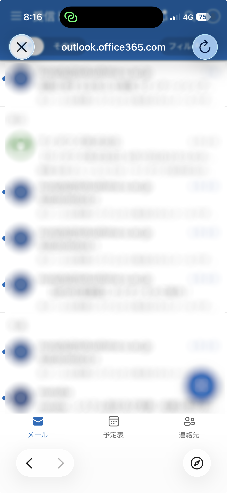
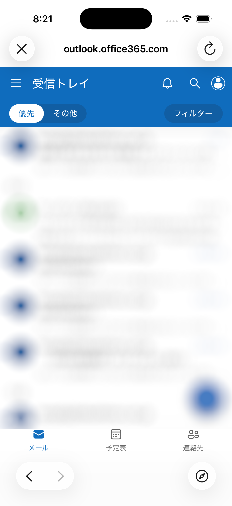
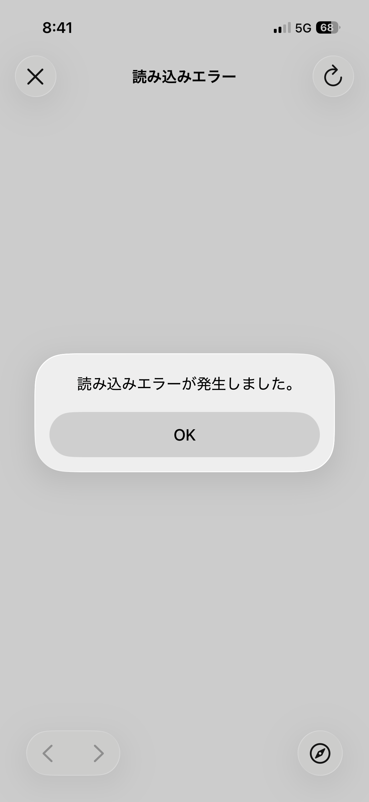

# v6.0.1 — 2026-05-14

## Overview

今回のアップデートでは、[v6.0.0](./v6.0.0)で報告をいただいた不具合を修正しました！
[v6.0.0](./v6.0.0)から1週間以内に修正してリリースすることができました！報告してくださった皆様、本当にありがとうございます！

## Update highlights

### 1. Liquid Glass 関連

アプリ内の Outlook の操作ができなくなる不具合を修正しました。
Liquid Glass により Outlook 内のナビゲーションコントローラーが、アプリのナビゲーションバーにかぶってしまい操作できなくなっていました。

AutoLayout で `WKWebView` をセーフエリアの中に収めるようにして修正しました。

|修正前|修正後|
|-------|----|
|||

### 2. 一部の端末で教務システムが開けない

一部の端末で教務システムが開けない不具合の修正をしました。

従来はシステム都合により **非推奨** な API を使用してHTTP通信を許容する設定をしていました。
その結果、新しいバージョンの iOS を使用するとこの設定が無効になってしまい、アクセスができなくなっていたようです。

非推奨の API を推奨されている API に置き換えることで修正しました。

### 3. 教務システムに初回アクセス時に一回エラーが出る

教務システムに初回アクセス時に以下のようなエラーが出ていました。

|エラー表示|
|--------|
||

認証をしてからリダイレクトをするときに、サーバーの仕様上特定のエラーが出てしまうことが原因のようでした。

無視しても良いエラーであったため、そのエラーを無視するように変更しました。

### 4. その他の細かな変更

- 大学の授業支援システムでページスワイプ時に一瞬黒い画面が表示される問題を修正しました。
- iPad iOS 18.6 でメニューがうまく表示されない問題を修正しました。
- カメラとマイクの使用を大学のサイト内のみで許可するよう変更しました。
- デバッグ用の画面が表示されないように修正しました。
- パスワードに設定できる文字数を50文字に増やしました。
